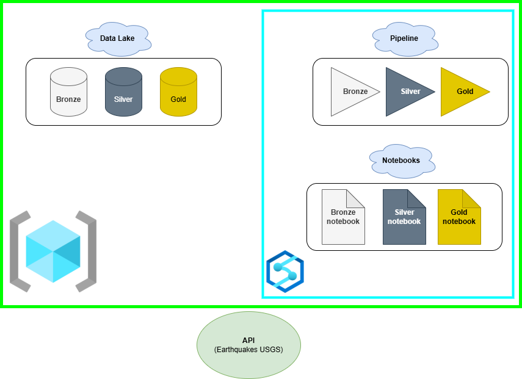

# Azure-DataEngineering-Project
### From Raw Data to Azure Synapse Analytics! 

This project focuses on data engineering within Azure Synapse, utilizing the USGS Earthquake Hazards Program API to collect real-time earthquake data. The data is processed through three Synapse notebooks following the Medallion Architecture:  
1. **Bronze Notebook**: Ingests raw earthquake data from the API.
2. **Silver Notebook**: Cleans and standardizes the data for consistency.
3. **Gold Notebook**: Aggregates and enriches the data for analytical insights.

The United States Geological Survey (USGS) Earthquake Hazards Program API provides real-time earthquake data worldwide. It allows users to query earthquake events based on parameters such as time, location, and magnitude.
[USGS]: [https://www.usgs.gov/programs/earthquake-hazards]

The diagram below visualizes the Azure services being used in this project.
